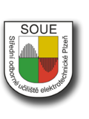

# Maturitní Ples IT4B & 4SCB

<div style="display: flex; gap: 40px; justify-content: center; flex-wrap: wrap; margin: 20px 0;">
  
  
</div>

**Maturitní Ples IT4B & 4SCB** – oficiální webová stránka společného maturitního plesu tříd IT4B (SOU Elektrotechnické Plzeň) a 4SCB (Střední průmyslová škola strojní a dopravní Plzeň). Moderní, responzivní a plná interaktivních prvků.

[](https://opensource.org/licenses/MIT)
[](https://developer.mozilla.org/en-US/docs/Web/HTML)
[](https://developer.mozilla.org/en-US/docs/Web/CSS)
[](https://developer.mozilla.org/en-US/docs/Web/JavaScript)

## Popis

Jednoduchá, rychlá a stylová one-page stránka pro propagaci maturitního plesu 2025. Obsahuje informace o místu konání, programu, maturantech obou tříd, učitelích, kontaktech a spoustu interaktivních prvků – swipe galerie, fullscreen obrázky, smooth scroll, glass navbar a přepínání mezi třídami.

## Hlavní vlastnosti

- Responzivní design – perfektně funguje na mobilu i počítači  
- Interaktivní galerie maturantů (swipe / klikání)  
- Fullscreen prohlížeč fotek s plynulým načítáním  
- Přepínač mezi třídami IT4B ↔ 4SCB  
- Glassmorphism navbar s hamburger menu  
- Fade-in animace při scrollování  
- Časová osa programu (timeline)  
- Kontakty včetně sociálních sítí  

## Instalace a spuštění

1. Stáhni nebo naklonuj projekt  
2. Rozbal do libovolné složky  
3. Otevři `index.html` v prohlížeči (stačí dvojklik – žádný server není potřeba)  

Hotovo!

## Struktura projektu

```
maturitni-ples/
├── images/
│   ├── preview/    ← malé náhledy
│   └── full/       ← plné rozlišení + loga škol
├── style.css
├── script.js
├── index.html
└── README.md
```

## Autoři

**Vita Phone** – Frontend, JavaScript, interakce, design  
[](https://github.com/VitaPhoneCZ)

**Daryna** – Design, grafika, originální nápad 
[](https://github.com/dadada44)

---

**Líbí se vám stránka? Dejte hvězdičku – moc nám to pomůže!**

Made with passion & teamwork in Plzeň, Czech Republic
